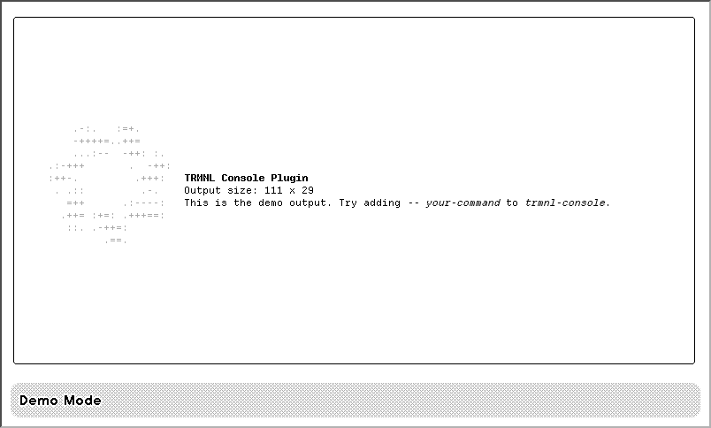
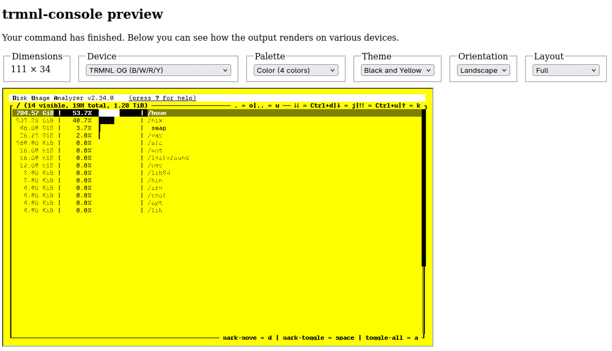
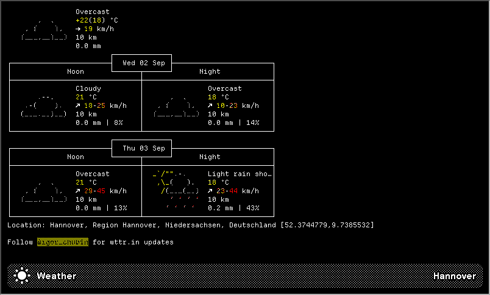
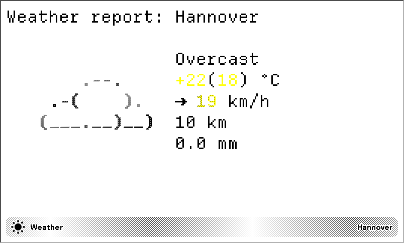
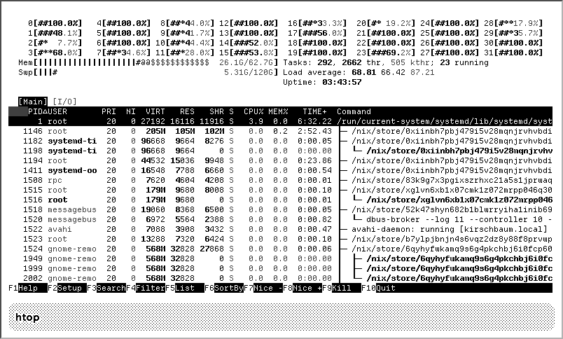
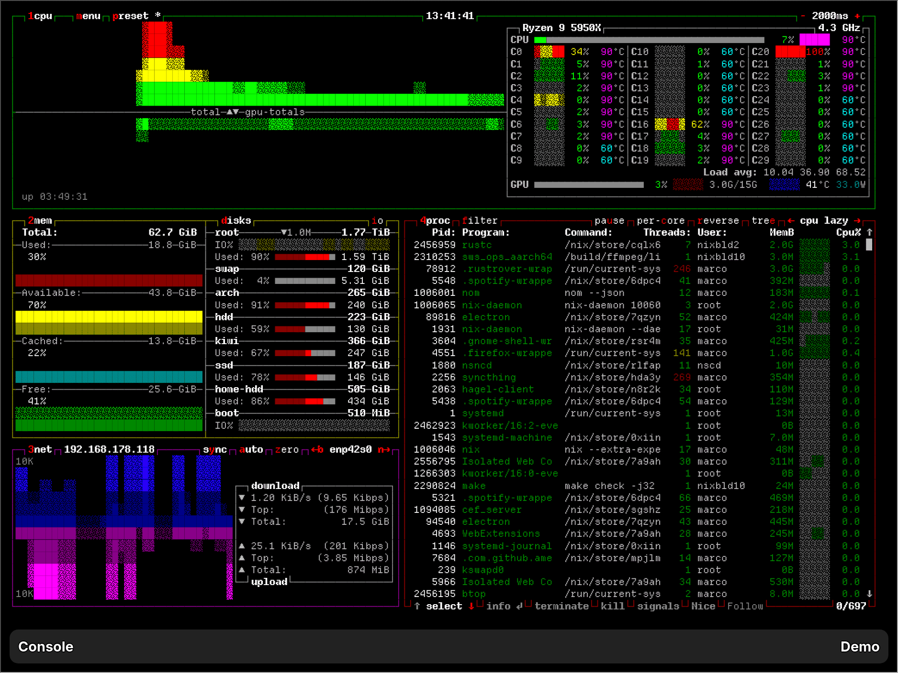
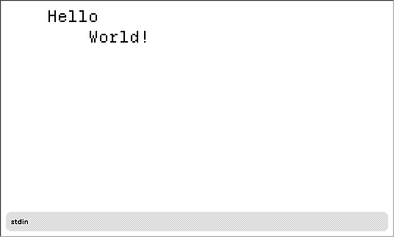
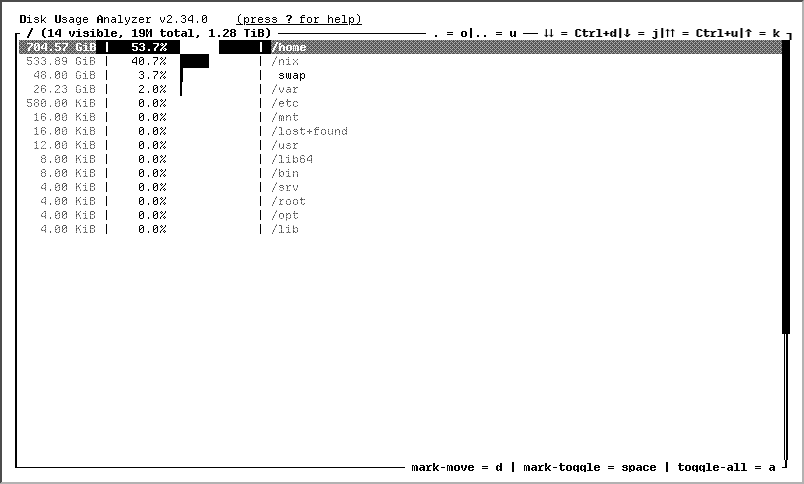

# "Console" plugin for TRMNL

**Plugin recipe**: [todo](todo)

`trmnl-console` is a TRMNL plugin recipe and command line tool that combined allow you to render any command line output
on a TRMNL-compatible device.

To get started, fork the [plugin recipe](todo) and install the CLI app.

## Install the CLI app

### Linux

1. Go to the [releases page](https://github.com/theCapypara/trmnl-console/releases).
2. From the latest release, download the `trmnl-console-X.X.X-x86_64-unknown-linux-gnu ` executable, where `X.X.X` is
   the latest version. Rename it to `trmnl-console`.
3. Open a terminal and navigate to the directory where you extracted the exe. Make it executable:
   `chmod +x trmnl-console`.
4. Run `./trmnl-console -w 111 -h 29 --url "https://<your forked plugin webhook URL>" --bar-left "It works!"` to send
   the demo screen to your plugin.
5. The plugin on TRMNL should now display the demo screen and "It works!" should be displayed on the bottom bar. You are
   now ready to use the plugin.

The CLI app may also be available from your favorite package manager. Additionally, a Nix flake is provided in the
repository: `nix run 'github:theCapypara/trmnl-console#trmnl-console' -- --help`

### macOS

1. Go to the [releases page](https://github.com/theCapypara/trmnl-console/releases).
2. From the latest release, download the `trmnl-console-X.X.X-aarch64-apple-darwin ` executable, where `X.X.X` is the
   latest version. Rename it to `trmnl-console`.
3. Open a terminal and navigate to the directory where you extracted the exe. Make it executable:
   `chmod +x trmnl-console`.
4. Run `./trmnl-console -w 111 -h 29 --url "https://<your forked plugin webhook URL>" --bar-left "It works!"` to send
   the demo screen to your plugin.
5. The plugin on TRMNL should now display the demo screen and "It works!" should be displayed on the bottom bar. You are
   now ready to use the plugin.

### Windows

1. Go to the [releases page](https://github.com/theCapypara/trmnl-console/releases).
2. From the latest release, download the `trmnl-console-X.X.X-x86_64-pc-windows-msvc.exe` executable, where `X.X.X` is
   the latest version. Rename it to `trmnl-console.exe`.
3. Open the windows terminal and navigate to the directory where you extracted the exe.
4. Run `.\trmnl-console.exe -w 111 -h 29 --url "https://<your forked plugin webhook URL>" --bar-left "It works!"` to
   send the demo screen to your plugin.
5. The plugin on TRMNL should now display the demo screen and "It works!" should be displayed on the bottom bar. You are
   now ready to use the plugin.

> [!IMPORTANT]
> Only the Linux client is thoroughly tested. Feel free to open an issue if you encounter any problems.

## Devices

`trmnl-console` supports any TRMNL-compatible device. To control the size of the output, use the `-w/--width` and
`-h/--height` flags. These should match the dimensions of the device. You can use the preview server and the table below
to find the optimal dimensions. You can control the size of the text by using the `--scale` flag.

| Device   | Orientation | --scale | Dimensions   |
|----------|-------------|---------|--------------|
| TRMNL OG | Landscape   | 1       | -w 111 -h 29 |
| TRMNL OG | Landscape   | 2       | -w 55 -h 14  |
| TRMNL OG | Landscape   | 3       | -w 37 -h 9   |
| TRMNL X  | Landscape   | 1       | -w 145 -h 51 |
| TRMNL X  | Landscape   | 2       | -w 73 -h 25  |
| TRMNL X  | Landscape   | 3       | -w 48 -h 17  |
| TRMNL X  | Landscape   | 4       | -w 36 -h 12  |
| TRMNL X  | Portrait    | 1       | -w 108 -h 69 |
| TRMNL X  | Portrait    | 2       | -w 54 -h 34  |
| TRMNL X  | Portrait    | 3       | -w 35 -h 23  |

> [!NOTE]
> The dimensions in the table are for the screen with a bottom bar. If you don't use the bottom bar, you can increase
the height by a couple of lines.

## Usage

`trmnl-console` has two required arguments, `-w/--width` and `-h/--height`. These control the size of the virtual
terminal that is used to capture the output of the command you want to render.

### Output

By default, the command will output the HTML that the plugin would render, see "Advanced Usage".

You instead probably want to send the output to your forked plugin. To do this, pass the `--url <url>` flag with the URL
of the webhook. This will send the output to the TRMNL servers and render the plugin.

> [!NOTE]
> TRMNL enforces size- and rate-limits for webhooks. If your output is too large or you are sending too many requests,
updating may fail. See the [TRMNL documentation](https://docs.trmnl.com/go/private-plugins/webhooks) for more
information.

There are two additional output modes: `--json` renders the JSON the plugin recipe needs (see "Advanced Usage") and
`--preview` starts an interactive preview of the output in your browser (see "Preview").

### Input

The command has three modes for what gets rendered:

- If you don't pass any additional arguments and don't pipe anything into the command a sample demo output is rendered,
  see "Examples".
- If you add `-- your-command` at the end, `your-command` will run and its output will captured when the command exits.
  By passing the `--wait-time` flag you can also capture the output earlier.
- You can pipe standard input into the command. It will then be rendered inside the virtual terminal. A snapshot will be
  taken when standard input is closed or `--wait-time` has passed.

### Bottom bar

TRMNL plugins can render a bar with information at the bottom of the screen. You can control the look of this bar using
parameters. If you don't pass any of these parameters, no bar will be rendered.

- `--bar-left` controls the title on the left side of the bar.
- `--bar-right` controls the title on the right side of the bar ("instance title", this is usually displayed in a dimmed
  gray).
- `--bar-icon` renders an icon on the left side of the bar.

## Preview

By passing the `--preview` flag you can launch an interactive preview of the output in your browser. Use this to test
the output on various devices and configurations.

## Examples

All examples below are screenshots from the preview server (`--preview`). For better readability, we added newlines to
the commands; you may need to remove when trying it out yourself.

<table>
    <tr>
        <td>
            
<strong>Demo Mode</strong>

            
Launch trmnl-console without a command or stdin to render the demo output.

            <pre><code>trmnl-console
    -w 111 -h 29
    --bar-left "Demo Mode"</code></pre>
        </td>
        <td>
            

            
<em>Rendered on TRMNL OG (2-bit) with 4 Grays (2-bit)</em>

            </td>
    </tr>
    <tr>
        <td>
            
<strong>Simple Command</strong>

            
Add <code>-- your-command</code> at the end to capture the output of a command when it finishes.

            <pre><code>trmnl-console
    -w 111 -h 29
    --bar-left "Weather" --bar-right "Hannover"
    --bar-icon "https://capypara.de/demos/sun-w.svg"
    -- curl 'wttr.in/Hannover?2n'</code></pre>
        </td>
        <td>
            

            
<em>Rendered on TRMNL OG (B/W/R/Y) with 4 colors; "Dark" theme</em>

            </td>
    </tr>
    <tr>
        <td>
            
<strong>Scale</strong>

            
Use <code>--scale</code> to control the scale of the output.

            <pre><code>trmnl-console
    --scale 3 -w 37 -h 9
    --bar-left "Weather" --bar-right "Hannover"
    --bar-icon "https://capypara.de/demos/sun.svg"
    -- curl 'wttr.in/Hannover?0n'</code></pre>
        </td>
        <td>
            

            
<em>Rendered on TRMNL OG (B/W/R/Y) with 4 colors</em>

            </td>
    </tr>
    <tr>
        <td>
            
<strong>TTY Apps</strong>

            
Use <code>--wait-time</code> to take a snapshot after a certain time, without waiting for a command to 
               exit. You can pass environment variables to the command, in this example <code>NO_COLOR</code> is used to 
               disable <code>htop</code>s color output.

            <pre><code>NO_COLOR=1 trmnl-console
    -w 111 -h 29
    --wait-time 2
    --bar-left "htop"
    -- htop</code></pre>
        </td>
        <td>
            

            
<em>Rendered on TRMNL OG (1-bit) in Black & White</em>

            </td>
    </tr>
    <tr>
        <td>
            
<strong>Supports ANSI 256-color sequences</strong>

            <pre><code>trmnl-console
    -w 144 -h 50
    --wait-time 120
    --bar-left "Console" --bar-right "Demo"
    -- btop --tty</code></pre>
        </td>
        <td>
            

            
<em>Rendered on Onyx BOOX Nova Air C with 4096 colors; "Dark" theme</em>

            </td>
    </tr>
    <tr>
        <td>
            
<strong>Stdin</strong>

            
You can also render input piped from stdin.

            <pre><code>printf "    Hello  \n        World!" |
    trmnl-console
        --scale 3 -w 37 -h 9
        --bar-left "stdin"</code></pre>
        </td>
        <td>
            

            
<em>Rendered on TRMNL OG (2-bit) with 4 Grays (2-bit)</em>

            </td>
    </tr>
    <tr>
        <td>
            
<strong>No bottom bar</strong>

            
The bottom bar can be controlled with the `--bar-*` parameters. If omitted, no bar is rendered.

            <pre><code>trmnl-console
    -w 111 -h 34
    --wait-time 120
    --pass-stderr
    -- dua -x i /</code></pre>
        <td>
            

            
<em>Rendered on TRMNL OG (2-bit) with 4 Grays (2-bit)</em>

            </td>
    </tr>
</table>

## Advanced Usage

You can use `trmnl-console --help` to get more advanced usage information and information about the formats used
internally by the plugin.

By using the `--json` output you can write the output that would be sent via webhook to stdout. Using this, you can also
configure the plugin to poll the contents of this file.

If you don't specify another output mode (`--json`, `--preview`, `--url`) the command will output HTML on stdout. This
is the same HTML rendered by the plugin. You can use this to implement your own custom UI/rendering logic.
